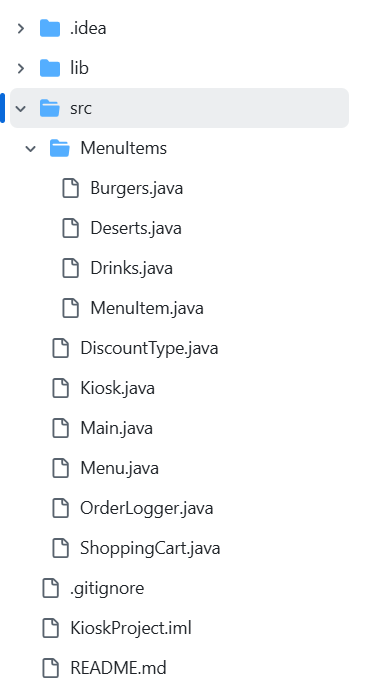

# 콘솔을 이용한 Kiosk 프로그램

---

### 목차

[1. 개발환경](#1-개발환경) 
[2. 요구사항](#2-요구사항) 
[3. 도전기능](#3-도전기능) 
[4. 패키지/파일](#4-패키지파일) 
[5. 프로그램 사용법](#5-프로그램-사용법) 
[6. 주요 commit](#6-주요-commit)

### 1. 개발환경

+ JDK Amazon Corretto 17.0.13
+ IntelliJ IDEA 2024.2.2 (Ultimate Edition)
+ Git
+ GitHub

### 2. 요구사항

+ Lv 1. 햄버거 메뉴 출력 및 선택하기
+ Lv 2. 객체 지향 설계를 적용해 햄버거 메뉴를 클래스로 관리하기
+ Lv 3. 객체 지향 설계를 적용해 순서 제어를 클래스로 관리하기
+ Lv 4. 객체 지향 설계를 적용해 음식 메뉴와 주문 내역을 클래스 기반으로 관리하기
+ Lv 5. 캡슐화 적용하기

### 3. 도전기능

+ Lv 1. 장바구니 및 구매하기 기능을 추가하기
    + 장바구니는 메뉴명, 수량, 가격 정보를 저장하며, 항목을 동적으로 추가 및 조회할 수 있어야 합니다
+ Lv 2. Enum, 람다 & 스트림을 활용한 주문 및 장바구니 관리
    + 사용자가 결제를 시도하기 전에, 장바구니에 담긴 모든 메뉴와 총 금액을 출력합니다
    + 합산하여 총 금액을 계산하고, “주문하기”를 누르면 장바구니를 초기화합니다.
    + Enum 을 활용한 사용자 유형별 할인율 관리하기
    + 람다 & 스트림을 활용한 장바구니 조회 기능

### 4. 패키지/파일

#### 주요 기능

+ Main.java: 음식 종류, 메뉴 세팅, 프로그램 실행
+ Kiosk.java: 프로그램 흐름 제어
+ Menu.java: 메뉴 관리
+ ShoppingCart.java: 장바구니 관리
+ DiscountType.java: 할인율 관리
+ OrderLogger.java: 프로그램 로깅 방식 설정
+ MenuItem 패키지: 메뉴 규격 설정

### 5. 프로그램 사용법

#### 매장 이용법

1. Main 클래스에 Menu 객체를 생성하고 메뉴 종류 가짓수를 설정한다
2. MenuItem 객체를 생성해 메뉴를 setting 한다
3. Main 클래스를 실행한다

#### 손님 이용법

1. 주문 메뉴를 보고 주문하고 싶은 메뉴 종류를 선택해 번호를 입력한다
2. 출력된 메뉴들을 보고 주문하고 싶은 메뉴 번호를 입력한다
3. 출력되는 안내 문구에 따라 장바구니에 담고 싶으면 1, 취소하고 싶으면 2을 입력한다
4. 3 에서 1을 입력할 경우 장바구니에 메뉴가 담긴다 
   2를 입력할 경우 취소되고 메뉴판이 나온다
5. 장바구니에 상품이 담기면 메뉴 주문 외에 주문 확인과 전체 주문 취소가 가능하다
6. 4를 입력해 주문을 확인한다 
   5를 입력할 경우 전체 주문이 취소되고 다시 메뉴판이 나온다
7. 주문 확인 시 전체 주문 내역과 총 금액을 확인할 수 있다
8. 주문 확인 시 1을 입력하면 주문을 하게 되고 할인 정보를 입력할 수 있다 
   2를 입력하면 메뉴판으로 돌아가 더 주문을 할 수 있다 
   3을 입력하면 취소하고 싶은 메뉴를 영어로 입력해 취소할 수 있다
9. 본인에게 맞는 할인 정보를 확인하고 번호를 입력한다
10. 할인된 결제금액과 함께 주문이 완료되고 장바구니가 초기화된다

### 6. 주요 commit

+ [요구사항 Lv. 4 구현](https://github.com/Hokirby/Kiosk/commit/1c8fdcf643da03a8acecddece5f9dc7e09514e62)
+ [요구사항 Lv. 5 구현](https://github.com/Hokirby/Kiosk/commit/39229ada4fe0c723fc2e79b8d530d0ddfb9d61ab)
+ [장바구니 기능 추가](https://github.com/Hokirby/Kiosk/commit/9104eac91e6cf69a6e117a63105b576d9be1d98d)
+ [장바구니 분리 등 refactor](https://github.com/Hokirby/Kiosk/commit/4cc93620e4717851e35bc6843d5511ff7ecc931c)
    + 기존 Menu 안의 장바구니 기능 ShoppingCart 로 분리
    + Kiosk 내 중복되는 유효성 검사 코드 메소드로 분리
+ [할인율 관리 기능 추가](https://github.com/Hokirby/Kiosk/commit/b02163d7d2eaa9941b6dfd1ceadaccf46da67321)
+ [장바구니 수량 확인 기능 추가](https://github.com/Hokirby/Kiosk/commit/6b5818abd9a67fdf600b9009d449211ee83e5f08)
    + Collection 변경: ArrayList -> HashMap
+ [장바구니 상품 제거 기능 추가](https://github.com/Hokirby/Kiosk/commit/4840f3e216a2846ed5ad922030ed2320ecd3be23)
+ [MenuITem 접근 제어자 변경](https://github.com/Hokirby/Kiosk/commit/a68405f92aab36fe9628416c7a2a13c0b4d428f6)
    + 메뉴 정보 캡슐화 default -> private/protected
